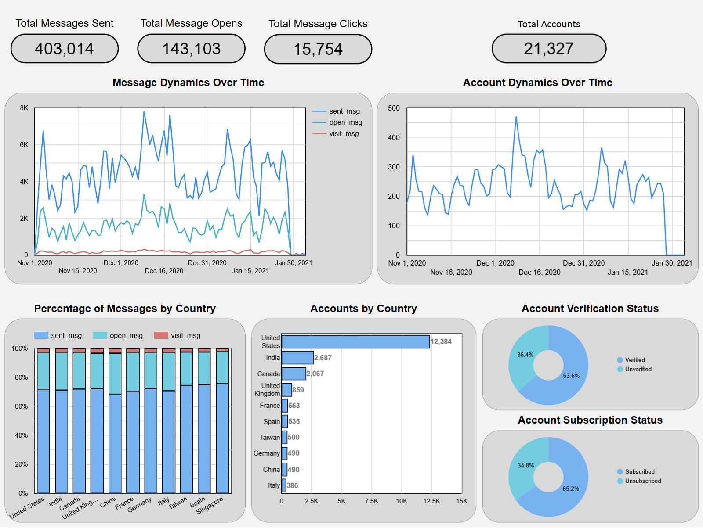

# Top 10 Countries by Account & Email Activity Analysis
**Portfolio project:** creating an SQL query to analyze and visualize account and email activity in Looker Studio, focusing on the top 10 countries by the number of accounts and sent emails.

---

## Project Objective
The goal of this project is to collect data that helps analyze **account creation dynamics**, **user activity via emails** (sending, opening, and visiting), and evaluate behavior across categories such as **send interval**, **account verification**, and **subscription status**.  
The data allows comparing activity between countries, identifying key markets, and segmenting users based on various parameters.

---

## SQL Query Structure

**File:** `account_email_activity.sql`

The query is structured into **6 CTEs:**
1. **accounts_metrics** – calculates total accounts.  
2. **email_metrics** – calculates email sends, opens and visits.  
3. **total_metrics** – merges both datasets using `UNION ALL`.  
4. **group_total_metrics** – groups `total_metrics` by country, date, send interval and user status.  
5. **add_metrics** – calculates total metrics per country using window functions.  
6. **add_metrics_1** – assigns ranking to countries by total accounts and sent emails.

Dimensions used for grouping and aggregation:
- **date** — the date (for accounts – account creation date, for emails – email send date);  
- **country** — user’s country;  
- **send_interval** — sending interval set by the account;  
- **is_verified** — whether the account is verified;  
- **is_unsubscribed** — whether the subscriber has unsubscribed.

---

## Dashboard Preview

**Visualization tool:** Google Looker Studio  

*Preview:*  
  

**[View interactive dashboard in Looker Studio](https://lookerstudio.google.com/reporting/e39398ff-d728-4763-8fca-1547b3bc6082)**

---

## Author

**Sviatoslav Mykytyn**  
📅 November 2025  
💼 Data Analytics Portfolio  
🔗 [LinkedIn](https://www.linkedin.com/in/sviatoslav-mykytyn-758997242/)
